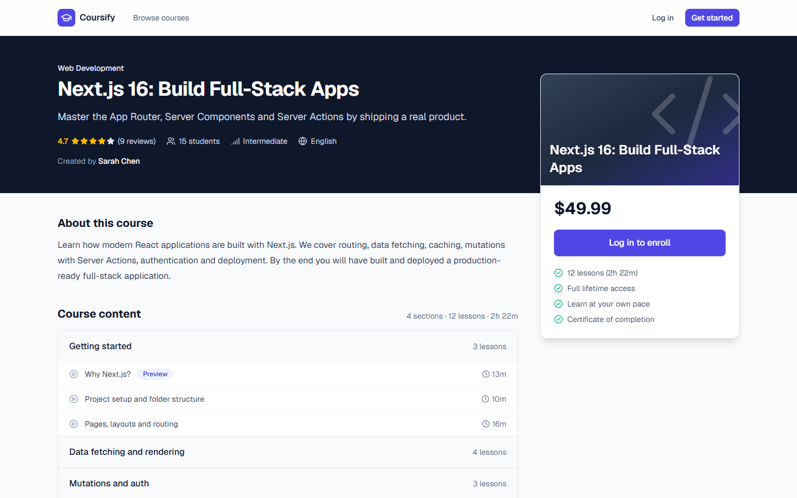
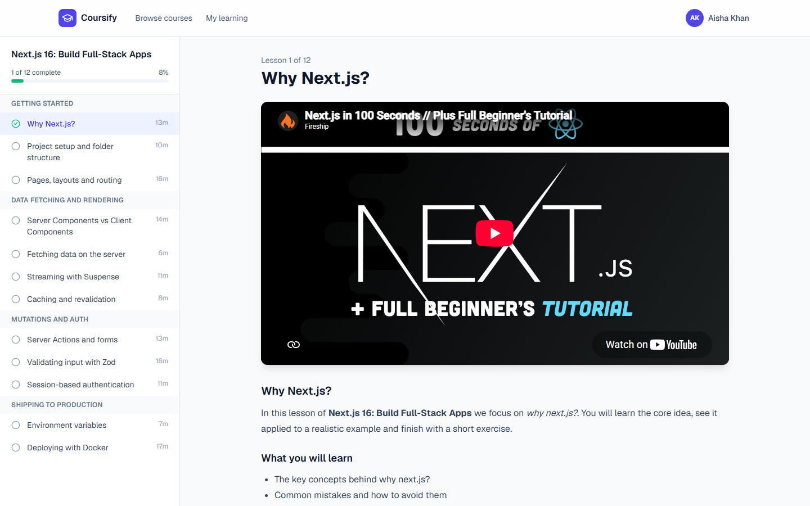
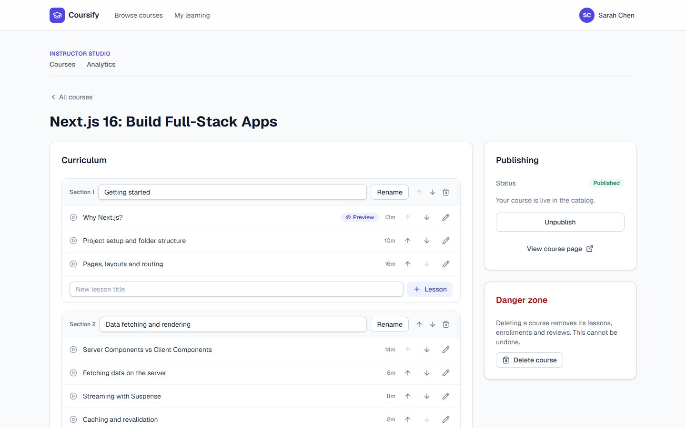
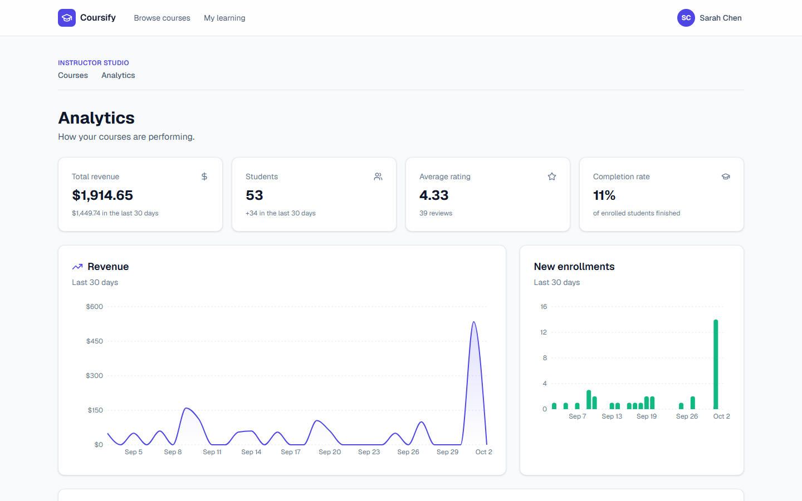
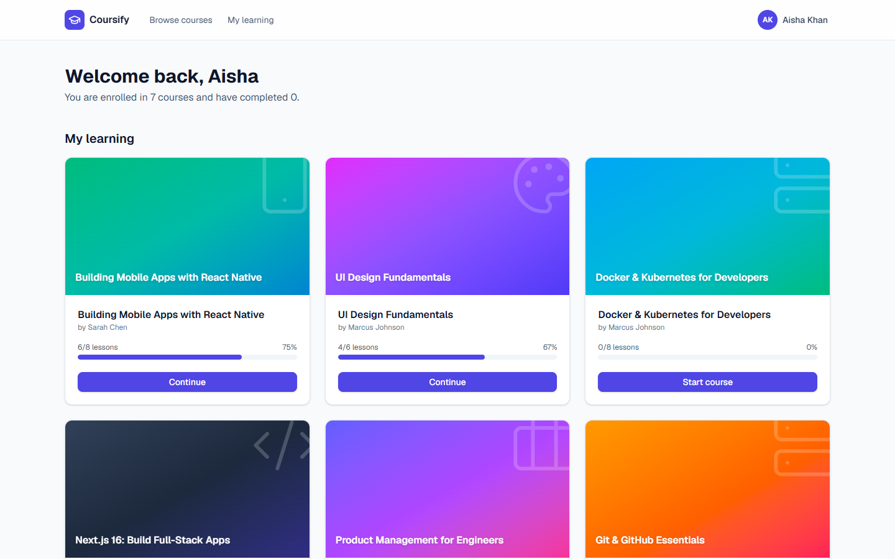
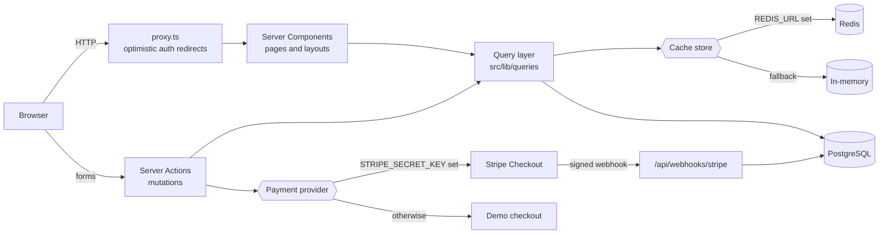

# Coursify — Full-Stack Learning Platform

[](https://github.com/ebrahimmorkas/coursify-lms/actions/workflows/ci.yml)


Coursify is an online course marketplace in the spirit of Udemy: **instructors** build and publish courses, **learners** buy them, watch lessons, track their progress and earn shareable certificates.

It is built with the Next.js 16 App Router, React Server Components and Server Actions on top of PostgreSQL, with **optional** Redis caching and **optional** Stripe payments — the app runs fully without either.



## Features

**Learners**

- Browse a searchable catalog with category, level, price filters, sorting and pagination
- Buy courses with Stripe Checkout — or a built-in demo checkout when Stripe is not configured
- Lesson player with YouTube/Vimeo video and Markdown content, curriculum sidebar and progress tracking
- Resume exactly where you left off; free preview lessons before buying
- Public, printable completion certificates
- Rate and review courses

**Instructors**

- Studio to create courses, organise sections and lessons (add, rename, reorder, delete) and publish
- Markdown lesson editor with video embeds and free-preview flags
- Analytics dashboard: revenue, students, ratings, completion rate and 30-day charts

**Platform**

- Secure email/password auth with database-backed sessions
- Redis-backed caching and rate limiting with automatic in-memory fallback
- SEO: dynamic metadata, `Course` JSON-LD, sitemap and robots.txt
- Health check endpoint, Docker image and CI pipeline

## Screenshots

| Catalog                                              | Lesson player                                        |
| ---------------------------------------------------- | ---------------------------------------------------- |
|              |  |
| **Instructor studio**                                | **Analytics**                                        |
|         |          |
| **Learner dashboard**                                | **Certificate**                                      |
|  |      |

## Tech stack

| Area                    | Technology                                                             |
| ----------------------- | ---------------------------------------------------------------------- |
| Framework               | Next.js 16 (App Router, Server Components, Server Actions, `proxy.ts`) |
| Language                | TypeScript (strict)                                                    |
| UI                      | React 19, Tailwind CSS 4, Lucide icons, Recharts, Sonner               |
| Database                | PostgreSQL 17 + Drizzle ORM (SQL migrations)                           |
| Validation              | Zod 4                                                                  |
| Caching / rate limiting | Redis (ioredis) **or** in-memory                                       |
| Payments                | Stripe Checkout + webhooks **or** demo checkout                        |
| Testing                 | Vitest (unit) + integration tests against PostgreSQL                   |
| Tooling                 | ESLint, Prettier, GitHub Actions, Docker                               |

## Architecture



### Design decisions

- **Database sessions instead of JWTs.** The cookie holds a random 256-bit token and only its SHA-256 hash is stored, so sessions are revocable and a leaked table cannot be replayed. Passwords use `scrypt` with per-user salts.
- **Optimistic proxy, authoritative pages.** `proxy.ts` only checks for the cookie to redirect quickly; every page and Server Action validates the session against the database and re-checks ownership of the resource it touches.
- **Pluggable infrastructure.** `CacheStore` and `PaymentProvider` interfaces have Redis/memory and Stripe/demo implementations selected from environment variables. A `FallbackStore` keeps the app working if Redis goes down mid-flight.
- **Cache invalidation by versioning.** Catalog queries are cached under a namespaced version key; any course change bumps the version, invalidating every cached search without scanning keys.
- **Idempotent payments.** Fulfilment performs a conditional `pending → paid` update in a transaction and inserts the enrollment with `ON CONFLICT DO NOTHING`, so duplicate or concurrent webhook deliveries can never double-enroll (covered by an integration test).
- **SQL does the heavy lifting.** Ratings, durations, revenue and daily series are computed in PostgreSQL (`FILTER`, `generate_series`, correlated subqueries backed by indexes) instead of in JavaScript.
- **Progressive enhancement.** Catalog filters and the curriculum editor are plain forms bound to Server Actions and work without client-side JavaScript.

## Getting started

### Prerequisites

- Node.js 20.9+ (22 recommended)
- Docker (for PostgreSQL and, optionally, Redis)

### Setup

```bash
git clone https://github.com/ebrahimmorkas/coursify-lms.git
cd coursify-lms
npm install

cp .env.example .env          # defaults work with docker compose
docker compose up -d          # PostgreSQL
npm run db:migrate            # apply migrations
npm run db:seed               # demo users, courses, enrollments and reviews
npm run dev                   # http://localhost:3000
```

### Demo accounts

All seeded accounts use the password `Password123`.

| Role       | Email                  |
| ---------- | ---------------------- |
| Instructor | `sarah@coursify.dev`   |
| Instructor | `marcus@coursify.dev`  |
| Student    | `student@coursify.dev` |

### Optional: Redis

```bash
docker compose --profile redis up -d
# .env
REDIS_URL=redis://localhost:6379
```

Without `REDIS_URL` the app uses a bounded in-memory store. `GET /api/health` reports which cache driver is active.

### Optional: Stripe

```bash
# .env
STRIPE_SECRET_KEY=sk_test_...
STRIPE_WEBHOOK_SECRET=whsec_...

# forward webhooks locally with the Stripe CLI
stripe listen --forward-to localhost:3000/api/webhooks/stripe
```

Without Stripe keys, paid courses use the demo checkout (clearly labelled; no card data is collected).

## Scripts

| Script                        | Description                                           |
| ----------------------------- | ----------------------------------------------------- |
| `npm run dev`                 | Start the development server                          |
| `npm run build` / `npm start` | Production build / server                             |
| `npm run lint`                | ESLint                                                |
| `npm run typecheck`           | Generate route types and run `tsc`                    |
| `npm test`                    | Unit tests                                            |
| `npm run test:integration`    | Integration tests against PostgreSQL (`DATABASE_URL`) |
| `npm run format`              | Prettier                                              |
| `npm run db:generate`         | Generate a migration from schema changes              |
| `npm run db:migrate`          | Apply migrations                                      |
| `npm run db:seed`             | Reset and seed demo data                              |
| `npm run db:studio`           | Open Drizzle Studio                                   |

## Testing

- **Unit tests** cover validation schemas, password hashing and tokens, the proxy (including a stale-cookie regression test), the cache stores and rate limiter, video URL parsing and curriculum navigation.
- **Integration tests** run against a real PostgreSQL database and verify that order fulfilment is idempotent under concurrent deliveries.
- **CI** (GitHub Actions) runs lint, typecheck, unit tests and a production build, then applies migrations and runs the integration suite against a PostgreSQL service container.

## Project structure

```
src/
├── app/                  # Routes (App Router)
│   ├── (auth)/           # Login, registration, auth actions
│   ├── courses/          # Catalog, course detail, enroll & review actions
│   ├── learn/            # Lesson player and progress actions
│   ├── studio/           # Instructor studio and analytics
│   ├── checkout/         # Demo checkout and success page
│   ├── certificates/     # Public certificates
│   └── api/              # Health check and Stripe webhook
├── components/           # UI primitives and feature components
├── db/                   # Drizzle schema and client
├── lib/
│   ├── auth/             # Passwords, sessions, guards
│   ├── cache/            # Redis / memory / fallback stores
│   ├── payments/         # Stripe and demo providers
│   ├── queries/          # Read models
│   └── validations/      # Zod schemas
└── proxy.ts              # Optimistic route protection
drizzle/                  # SQL migrations
scripts/                  # Seed script
```

## Deployment

The app builds to a standalone Node.js server:

```bash
docker build -t coursify .
docker run -p 3000:3000 --env-file .env coursify
```

It can also be deployed to any Node.js host (e.g. Vercel, Railway, Fly.io) with a managed PostgreSQL database. Run `npm run db:migrate` as part of the release.

## License

[MIT](LICENSE)
